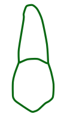
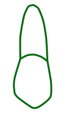
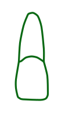
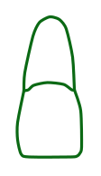

<p align="center">
  
  
  
  
  
  
</p>

<h1 align="center">Dental Icons Font</h1>

<p align="center">
  <strong>Digite odontogramas como quem digita texto.</strong><br>
  Uma fonte vetorial original criada para dentistas, documentos clínicos, apresentações e sistemas web.
</p>

<p align="center">
  <code>1.1.5-beta</code> · <code>OTF</code> · <code>TTF</code> · <code>WOFF2</code> · <code>OpenType</code> · <code>uso autorizado</code>
</p>

<p align="center">
  <a href="https://dantetesta.com.br/dental-icons-font/"><strong>Download oficial</strong></a>
  &nbsp;·&nbsp;
  <a href="dental-icons-font/index.html">Código da landing page</a>
  &nbsp;·&nbsp;
  <a href="https://www.dantetesta.com.br">Dante Testa</a>
</p>

> [!IMPORTANT]
> O download oficial deve ser feito em **[dantetesta.com.br/dental-icons-font](https://dantetesta.com.br/dental-icons-font/)**. Esta versão é beta e a anatomia dos glifos deve passar por revisão odontológica antes de uso clínico definitivo.

## Uma linguagem visual para odontologia

Dental Icons transforma códigos curtos em desenhos dentários vetoriais. A mesma sequência pode ser usada no Pages, Word, PowerPoint, LibreOffice, OpenOffice, aplicativos gráficos e interfaces web.

```text
M3 M2 M1 P2 P1 C L I | I L C P1 P2 M1 M2 M3
```

| Família | Representação | Onde usar |
|:--|:--|:--|
| **Dental Icons Up** | Arcada superior | Pages, Word, OTF, TTF, WOFF2 e CSS |
| **Dental Icons Down** | Arcada inferior | Pages, Word, OTF, TTF, WOFF2 e CSS |

Os nomes são idênticos em todos os ambientes. Não existe mais um nome para desktop e outro para web.

## O mesmo dente, duas leituras

<table>
  <tr>
    <th align="center">Maiúscula · perfil</th>
    <th align="center">Minúscula · face oclusal</th>
  </tr>
  <tr>
    <td align="center">
      <br>
      <code>M1</code>
    </td>
    <td align="center">
      <br>
      <code>m1</code>
    </td>
  </tr>
</table>

| Código | Elemento dental | Maiúscula | Minúscula |
|:--:|:--|:--:|:--:|
| `I` / `i` | Incisivo central | perfil | face oclusal |
| `L` / `l` | Incisivo lateral | perfil | face oclusal |
| `C` / `c` | Canino | perfil | face oclusal |
| `P1` / `p1` | Primeiro pré-molar | perfil | face oclusal |
| `P2` / `p2` | Segundo pré-molar | perfil | face oclusal |
| `M1` / `m1` | Primeiro molar | perfil | face oclusal |
| `M2` / `m2` | Segundo molar | perfil | face oclusal |
| `M3` / `m3` | Terceiro molar | perfil | face oclusal |

A barra `|` marca a linha média. As alternâncias contextuais selecionam automaticamente as formas anatômicas do lado direito da arcada.

## Comece em dois minutos

### macOS · Pages, Keynote e Office

1. Faça o [download oficial](https://dantetesta.com.br/dental-icons-font/) e extraia o pacote.
2. Na pasta `macOS`, instale somente `DentalIconsUpper-Regular.otf` e `DentalIconsLower-Regular.otf`.
3. Remova versões antigas antes da instalação; não mantenha famílias duplicadas.
4. Encerre o Pages ou Keynote com `Command + Q` e abra novamente.
5. Escolha **Dental Icons Up** ou **Dental Icons Down**.
6. Se `M1` ou `P2` não formar um dente, ative **Formatar → Fonte → Ligadura → Usar Padrão** ou **Usar Tudo**.

### Windows · Word, PowerPoint e LibreOffice

1. Faça o [download oficial](https://dantetesta.com.br/dental-icons-font/) e abra a pasta `Windows-Linux`.
2. Instale os dois arquivos TTF; no Windows, escolha **Instalar para todos os usuários** quando disponível.
3. Feche e reabra o editor.
4. Selecione **Dental Icons Up** ou **Dental Icons Down** e mantenha as ligaturas OpenType habilitadas.

> [!TIP]
> O pacote inclui `MAPA-DE-GLIFOS.txt` com 32 pontos Unicode PUA diretos por família. Eles são a alternativa para aplicativos que não executam ligaturas OpenType.

## Webfont com os mesmos nomes

Publique os dois WOFF2 e `dental-icons.css` no mesmo diretório:

```html
<link rel="stylesheet" href="/fonts/dental-icons.css">

<span class="dental-icons-upper">M1 P2 C L I | I L C P2 M1</span>
<span class="dental-icons-lower">m1 p2 c l i | i l c p2 m1</span>
```

Também é possível aplicar as famílias diretamente:

```css
.arcada-superior { font-family: "Dental Icons Up"; }
.arcada-inferior { font-family: "Dental Icons Down"; }
```

O CSS fornecido já ativa `ccmp`, `liga`, `calt` e `kern`, necessários para códigos compostos e formas contextuais.

## Novidades e melhorias

### 1.1.5-beta · nomes unificados

- **Dental Icons Up** e **Dental Icons Down** agora são os nomes canônicos em OTF, TTF, WOFF2, Pages, Word e CSS.
- O CSS deixou de exigir os antigos aliases `Dental Icons Upper` e `Dental Icons Lower`.
- Uma substituição contextual exclusiva recompõe “Dental Icons Up/Down” como texto legível nos menus, sem roubar `I`, `L`, `C` e `P` dos códigos dentários.
- Landing page, instaladores, exemplos e documentação foram sincronizados com os nomes novos.

### 1.1.4-beta · escala óptica e legibilidade

- Os dentes foram ampliados em aproximadamente **19%** dentro do mesmo corpo de 1000 unidades por em.
- A escala interna passou de `4.2` para `5.0`, mantendo o avanço em `520` unidades.
- Os contornos permanecem na janela vertical segura de `-200` a `800`, reduzindo o risco de cortes no Pages, Word e PDF.
- O tamanho 11 pt ganhou presença visual; para impressão confortável, recomenda-se começar entre 14 e 18 pt.
- As letras usadas nos menus receberam desenho sans-serif mais limpo e curvas mais legíveis.

### Landing page e demonstração

- Interface localizada em português do Brasil, português de Portugal, inglês e espanhol.
- Idioma lembrado localmente e detecção inicial por país quando não há preferência salva.
- Simulador de sequência, arcada, vista, tamanho, espaçamento, composição e cor.
- Comparação simultânea entre perfil e face oclusal.
- Download oficial disponibilizado no site pessoal de Dante Testa.

## Arquitetura tipográfica

| Especificação | Implementação |
|:--|:--|
| Unidades por em | `1000 UPM` |
| Avanço principal | `520` unidades |
| Métricas verticais | ascendente `800`, descendente `-200` |
| Contornos OTF | CFF / PostScript |
| Contornos TTF e WOFF2 | TrueType quadrático |
| Composição | `ccmp` e `liga` |
| Lado anatômico | `calt` contextual após `|` |
| Espaçamento | `kern` |
| Fallback | 32 códigos Unicode PUA por família |
| Incorporação | `fsType = 0`, instalação e embedding permitidos |

O repositório preserva 64 referências raster, 64 SVGs Bézier e o pipeline reproduzível que gera todos os artefatos finais.

<details>
<summary><strong>Compilação e validação reproduzíveis</strong></summary>

### Dependências

```bash
python3 -m pip install -r requirements.txt
brew install librsvg imagemagick potrace woff2
```

### Reconstruir fontes e pacote

```bash
python3 -B scripts/vectorize_reference.py
python3 -B scripts/build_fonts.py
```

O empacotador trabalha a partir de uma lista positiva de runtime. O ZIP público não recebe arquivos internos, credenciais, testes, caches, históricos ou documentação de agentes.

### Executar os validadores

```bash
python3 -B scripts/validate_fonts.py
swift scripts/validate_coretext.swift build/fonts/*.otf build/fonts/*.ttf
```

Os testes conferem:

- tabelas obrigatórias e integridade estrutural;
- nomes internos, revisão, métricas e permissão de incorporação;
- mapas Unicode e repertório PUA;
- distinção entre maiúsculas e minúsculas;
- ligaturas `P1`, `P2`, `M1`, `M2` e `M3`;
- alternâncias esquerda/direita após a linha média;
- legibilidade de `Dental Icons Up` e `Dental Icons Down`;
- leitura por Fontconfig e CoreText;
- descompressão e shaping dos WOFF2;
- lista positiva, padrões sensíveis e CRC do ZIP público.

</details>

<details>
<summary><strong>Estrutura do projeto</strong></summary>

```text
assets/reference-glyphs/      referências raster preservadas
assets/reference-vectors/     SVGs Bézier que alimentam a fonte
scripts/                      vetorização, compilação e validadores
build/fonts/                  OTF, TTF, WOFF2 e staging público
dental-icons-font/            landing page e simulador
dental-icons-font/downloads/  pacote ZIP gerado para o site oficial
tests/                        prova de carregamento da webfont
index.html                    inspeção técnica dos desenhos
```

</details>

## Autoria e proveniência

Projeto concebido, dirigido e produzido por **Dante Testa** em 2026.

Os glifos foram desenvolvidos a partir dos desenhos dentários de referência preservados em [`assets/reference-glyphs`](assets/reference-glyphs). Eles não foram extraídos de fonte comercial, biblioteca de ícones ou pacote vetorial de terceiros.

O processo documentado no histórico Git inclui:

1. isolamento das 64 referências por posição, arcada e vista;
2. limpeza e reconstrução do eixo central;
3. conversão de curvas Catmull–Rom para Bézier;
4. normalização anatômica, óptica e métrica;
5. geração de contornos TrueType e CFF/OpenType;
6. criação de ligaturas, alternâncias contextuais e mapa PUA;
7. geração determinística de OTF, TTF, WOFF2 e ZIP.

Ferramentas de inteligência artificial auxiliaram o desenvolvimento sob direção, seleção e aprovação de Dante Testa. Os desenhos dentários e as decisões criativas deste projeto não são fornecidos por essas ferramentas nem por bibliotecas tipográficas externas.

## Compatibilidade

| Formato | Uso recomendado |
|:--|:--|
| **OTF/CFF** | macOS, Pages, Keynote, Office para Mac e aplicativos gráficos |
| **TTF/TrueType** | Windows, Linux, Microsoft Office, LibreOffice e OpenOffice |
| **WOFF2** | navegadores e sistemas web; não instalar como fonte desktop |

As versões atuais foram validadas com FontTools, HarfBuzz, Fontconfig, WOFF2 e CoreText. Compatibilidade absoluta com toda versão histórica de todo editor não pode ser garantida; por isso o mapa PUA acompanha a distribuição.

## Uso autorizado, autoria e direitos

**Dental Icons Font pode ser usada gratuitamente em documentos, imagens, materiais impressos, sites, aplicativos e sistemas, inclusive em projetos profissionais e comerciais**, conforme os termos da [`LICENSE`](LICENSE).

O repositório é público para transparência técnica, preservação da autoria e auditoria do processo criativo. A fonte não pode ser revendida, republicada como arquivo avulso, renomeada ou distribuída em versão modificada sem autorização expressa.

**Download oficial:** [dantetesta.com.br/dental-icons-font](https://dantetesta.com.br/dental-icons-font/)<br>
**Autor:** Dante Testa · [www.dantetesta.com.br](https://www.dantetesta.com.br)

Copyright © 2026 Dante Testa. Todos os direitos não concedidos expressamente permanecem reservados.

Dental Icons Font é uma ferramenta de representação visual e não substitui avaliação, diagnóstico ou documentação clínica profissional.
